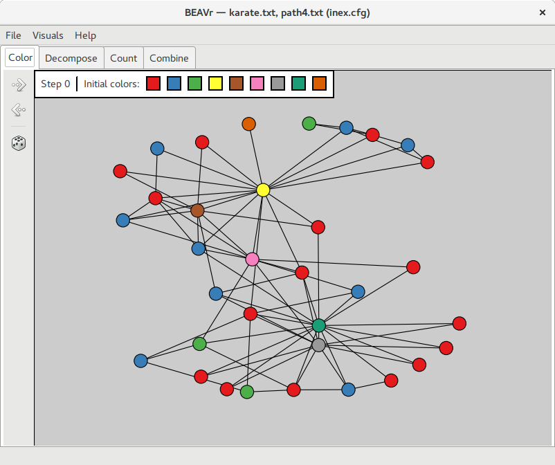

# BEAVr: Bounded Expansion Algorithm Visualizer 
## Usage
To run the program, execute the following command in the command line. 

    ./run_beavr.py [FILENAME]
    
If the program is run without an filename argument, then a blank tab with the title “No Visualization” appears. The toolbar contains a button that allows users to quickly open a ZIP file containing pipeline execution data. Once an archive has been opened, the layout will change into something similar to this:

Each tab contains a visualization of a particular step.

### ZIP Archive Format

The archive file provided by CONCUSS has the following contents:
* **visinfo.cfg** : Specifies what pipeline the archive came from
Contains command that was used to run the pipeline
Contains filenames of graphs within the archive
* **config.cfg** : Configuration file used for this run of the pipeline
* **[graph.???\*]**
* **[pattern.???]**
* **color/**
..* **orientation.txt**
..* **arcs.txt**
..* **colorings/**
....* **0**
....* **1**
....* ...
* **count/**
..* **big_component.txt** : The largest component found during the decomposition stage, in edgelist format, with vertices numbered the same as in **graph.???**
..* **dp_table.txt** : The dynamic programming table generated while counting the number of occurrences of **pattern.???** in the given component.  The format of this file is given below in section 5.2.1. 
..* **tdd.txt** : The treedepth decomposition of the component in big_component.txt computed by CONCUSS.

* **combine/**
..* **counts_per_colorset.txt** : Counts of the motif for each color set that CONCUSS iterates over. The format of this file is given below in section 5.2.3.

*where ??? is one of {gml, txt, graphml, leda, gexf}.

### Color Tab

The color tab has three buttons on the toolbar and a view of the host graph. The arrow buttons allow the user to step forwards and backwards through the steps of the coloring stage of CONCUSS. The die icon randomizes the layout of the graph. 

### Decompose Tab

The toolbar for the decompose tab is a series of togglable buttons for each color in the graph. When a color is selected, the visual is updated to display each component of the graph that contain the selected color. A legend is in the upper left corner of the display that lists the current selection of colors. 

For components that occur multiple times, only one instance is displayed with a number that indicates the number of duplicates. If the user selects more colors than the number of nodes in the pattern, then the legend turns red to indicate that components induced on this color set are no longer guaranteed to have a center.

### Count Tab

The Count tab gives an overview of how CONCUSS counts the number of occurrences of a motif in each subgraph found in the Decompose stage.  The visualization focuses on the largest subgraph found during the execution of CONCUSS, whose color set is shown in the upper-left corner of the display.

The display consists of three columns.  At the top of each column, a k-pattern of the motif is displayed. CONCUSS uses these k-patterns to count pieces of the motif and join them together to find the total count for each component.  Below each k-pattern is the component, colored to indicate how the k-pattern can be mapped to vertices in the host graph in this particular instance.  The numbered boundary vertices must map exactly, the white anonymous vertices from the k-pattern can be mapped in any way as long as they are connected properly, and the gray vertices are not in the k-pattern so may be mapped anywhere else.  Finally, we highlight several occurrences of the motif in the component, found by mapping the k-pattern as indicated.  A new display may be generated by clicking the die button on the toolbar, which chooses a new set of k-patterns found by CONCUSS.

### Combine Tab

The combine tab shown above does not contain a toolbar on the side. Rather, it contains buttons for four different colorings of the pattern as well as a button for the total computation. Each button corresponds to a different page. Each page illustrates the inclusion and exclusion formula. 

Each page has three columns: one for inclusion-exclusion coefficients, one for the actual color sets, and one for the resulting term in the final equation. The bottom of each page also displays the total count of a particular pattern or the total count overall.

## Install and Software Requirements

The target platforms for BEAVr are Linux and Mac OSX.

### Mac OS X

BEAVr has the following dependencies that need to be installed on Mac OS X:
* NetworkX
* matplotlib
* NumPy
* wxPython

In order to install these dependencies, first download get-pip.py [here](https://bootstrap.pypa.io/get-pip.py).
To install pip, use the command:

    $ python get-pip.py

Once pip is installed, install other dependencies using the following commands:

NetworkX:

    $ sudo pip install networkx

matplotlib:

    $ sudo pip install matplotlib

NumPy:

    $ sudo pip install numpy

wxPython:

Download [wxPython3.0-osx-cocoa-py2.7](http://downloads.sourceforge.net/wxpython/wxPython3.0-osx-3.0.2.0-cocoa-py2.7.dmg). After download has completed, run wxPython3.0-osx-3.0.2.0-cocoa-py2.7.dmg. In case there are any problems with installation, consult fixes below for possible solutions:

wxPython Installation Fixes for OSX:
1. Installing bundle package from wxPython's [website](http://www.wxpython.org/download.php). System Preferences > Security & Privacy > Click the lock to make changes > Select 'Anywhere' for 'Allow apps downloaded from'. Try installing bundle package again. If you still have issues, try Installation Fix 2. (Be sure to change your 'Allow apps downloaded from' back to 'Mac App Store and Identified Developers' once done.)
2. OSX doesn't like bundle packages, preferring flat packages. If you had issues installing the bundle package available for download, you can use Homebrew to install wxPython instead. Install [Homebrew](http://brew.sh/) if you do not already have it. Once installed, open terminal and type 'brew install wxPython'. Follow instructions given by Homebrew if any errors occur.

Once all required dependencies have been installed, the next step is to download BEAVr from this repository.  The preferred way to do this is using git, with the command:

    $ git clone https://github.ncsu.edu/engr-csc-sdc/2016springTeam09.git

This downloads the current development version of BEAVr into a directory called 2016springTeam09.  You can now start the tool by running the vistool.py file.

### Linux

First, install BEAVr’s dependencies: Python 2.7, wxPython, NetworkX, matplotlib, and NumPy.  Installing Graphviz is also highly recommended for improved graph layout in some stage visualizations, but this is not required.  All dependencies are available in the package repositories of most major Linux distributions, and installing them will almost certainly require root privileges.  For example, in Fedora, the dependencies can be installed with one command:

    $ sudo dnf install python wxPython python-networkx python-matplotlib numpy graphviz*

The package names may vary for different distributions, and an exhaustive list for all distributions is beyond the scope of this document.  If you encounter any problems installing dependencies, consult your distribution’s documentation.

Once these dependencies have been installed, the next step is to download BEAVr from Github.  The preferred way to do this is using git, with the command:

    $ git clone https://github.ncsu.edu/engr-csc-sdc/2016springTeam09.git

You can now start the tool by running the run_beavr.py file.
## Acknowledgements
